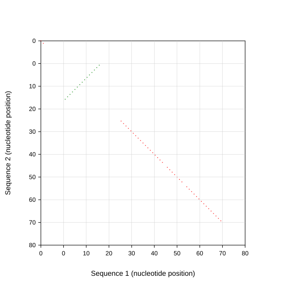

# DNA Dot Plot Generator

[](https://github.com/quadram-institute-bioscience/dnadotplot/actions/workflows/test.yml)


A Rust tool for generating dot plot alignments between DNA sequences from FASTA files.



## Installation

Currently, the project requires Rust and Cargo to build. Follow these steps to install:

```bash
cargo build --release
```

## Usage

The tool provides three main commands for flexible DNA sequence analysis:

### Commands

- `plot`: Generate dot plot directly from FASTA sequences to image
- `matrix`: Generate dot plot matrix from FASTA sequences to TSV file  
- `render`: Render dot plot image from matrix TSV file

### Direct Plotting (FASTA → Image)

```bash
./target/release/dnadotplot plot -1 <file1.fa> [-2 <file2.fa>] -o <output.png> [options]
```

**Options:**
- `-1`, `--first-file`: First FASTA file (required)
- `-2`, `--second-file`: Second FASTA file (optional, defaults to self-alignment)
- `-o`, `--output`: Output file (PNG or SVG based on extension)
- `-s`, `--img-size`: Image size - pixels if >1, fraction of sequence length if <1 (default: 0.3)
- `-w`, `--window`: Window size for alignment (default: 10)
- `--revcompl`: Use reverse complement matching
- `-f`, `--first-name`: Specific sequence name from first file
- `-n`, `--second-name`: Specific sequence name from second file
- `--svg`: Force SVG output

### Matrix Generation (FASTA → Matrix)

```bash
./target/release/dnadotplot matrix -1 <file1.fa> [-2 <file2.fa>] -o <matrix.tsv> [options]
```

Creates a TSV file with metadata headers containing the dot plot matrix data.

### Matrix Rendering (Matrix → Image)

```bash
./target/release/dnadotplot render -i <matrix.tsv> -o <output.png> [options]
```

**Options:**
- `-i`, `--input`: Input matrix TSV file (required)
- `-o`, `--output`: Output file (PNG or SVG based on extension)
- `--svg`: Force SVG output

## Examples

### Direct Plotting
```bash
# Self-alignment of E. coli genome
./target/release/dnadotplot plot -1 input/ecoli.fa -o ecoli_self.png -s 1000

# Cross-alignment between two genomes  
./target/release/dnadotplot plot -1 input/bbreve.fa -2 input/ecoli.fa -o comparison.png

# Generate SVG output
./target/release/dnadotplot plot -1 genome.fa -o plot.svg -s 0.5 --svg
```

### Matrix Workflow
```bash
# Generate matrix from sequences
./target/release/dnadotplot matrix -1 input/ecoli.fa -o ecoli_matrix.tsv -s 800 --revcompl

# Render matrix to different formats
./target/release/dnadotplot render -i ecoli_matrix.tsv -o ecoli_plot.png
./target/release/dnadotplot render -i ecoli_matrix.tsv -o ecoli_plot.svg
```

### Output Formats

- **PNG**: Grayscale images where black=match, white=no match, gray=reverse complement match
- **SVG**: Styled plots with axes, labels, and colored dots (red=forward match, green=reverse complement)
- **TSV Matrix**: Tab-separated matrix files with metadata headers for external processing

## Testing and Comparison System

To regenerate test images and create a visual comparison with reference images:

```bash
# Generate comparison images and HTML report
python3 tests/debug/generate_comparison.py
```

This command will:

1. Build the latest version of dnadotplot
2. Parse reference images in `tests/page/img/` with format `{seq1}-{seq2}-wnd{window}-w{width_ratio}.{format}`
3. Generate corresponding images using `dnadotplot plot` with `--revcompl` flag
4. Save generated images to `tests/page/generated-imgs/`
5. Create an HTML comparison page at `tests/page/index.html`

The system is flexible - new reference images following the naming convention will automatically be included in the comparison when the script is run.

### Matrix File Format

Matrix files are TSV format with metadata headers:

```
# DNADOTPLOT_MATRIX_FORMAT_VERSION=1.0
# sequence1_name=genome1
# sequence1_length=4641652
# sequence2_name=genome2
# sequence2_length=4563278
# window_size=10
# reverse_complement=true
# image_size=1000
# creation_date=2024-06-24T10:30:00Z
# command=dnadotplot matrix -1 input/genome1.fa -2 input/genome2.fa -s 1000 -w 10 --revcompl
255	255	0	255	255	...
255	0	255	255	255	...
...
```

This format allows external tools to generate compatible matrices or process existing ones.

## License

MIT
